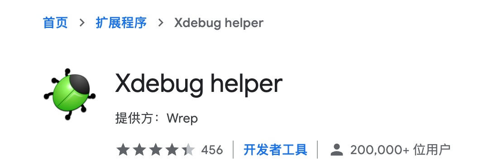
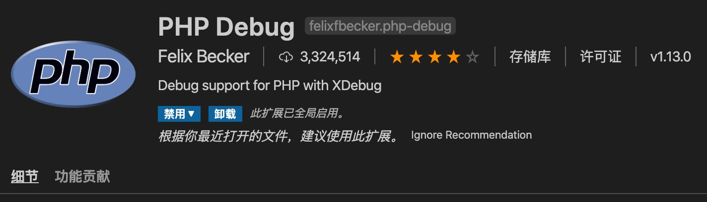
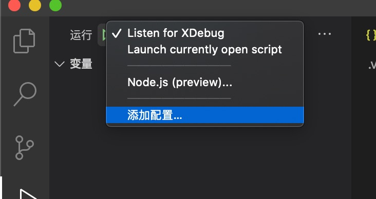

# Docker 搞定 PHP 开发环境搭建(VSCode XDebug)

## 1. 安装 nginx 并复制配置文件

```bash
$ docker run --name tmp-nginx -d nginx
$ docker cp tmp-nginx:/etc/nginx /etc/nginx
$ docker rm -f tmp-nginx
```

## 2. 构建 php-fpm

```bash
$ sh phpfpm7.3.8/build.sh
```

这个过程中需要替换源，否则某些包会安装失败。
7.3.8版本用的是debian 10。

## 3. 复制php-fpm配置文件

```bash
$ docker run --name tmp-my-php-fpm -d my-php-fpm:7.3.8
$ docker cp tmp-my-php-fpm:/usr/local/etc ./etc/php
$ docker rm -f tmp-my-php-fpm
```

## 4. 修改 nginx 配置文件

```nginx
# vim ./etc/nginx/conf.d
# 在 location / 下加入

location ~ \.php$ {
    fastcgi_pass   php-fpm-container:9000;
    fastcgi_index  index.php;
    fastcgi_param  SCRIPT_FILENAME  /var/www/html$fastcgi_script_name;
    fastcgi_param  SCRIPT_NAME      $fastcgi_script_name;
    include        fastcgi_params;
}
```

## 5. 修改 php-fpm xdebug 配置文件

在 `./etc/php/php/conf.d/docker-php-ext-xdebug.ini` 后面加入下面内容

```conf
xdebug.remote_connect_back=0
xdebug.remote_enable = On
xdebug.remote_mode = req
xdebug.remote_handler = dbgp
xdebug.remote_host = host.docker.internal       
xdebug.remote_port = 9001                       # 有人设置为9000，这个和IDE配置是联动的
xdebug.remote_log = /var/log/php/xdebug.log
xdebug.idekey = PHPSTORM
xdebug.remote_autostart = 1
```

`host.docker.internal` 是 docker 18.03 新加入的，可以解析获得宿主机的 ip 地址，这样就不用写死 ip 地址。

## 6. 启动服务

需要 redis，mysql等可以自行添加，也可用通过 `host.docker.internal` 获取宿主机的。

```bash
$ docker-compose up
```

## 7. 项目

所有的项目应该都放在 `www` 目录中。

## 8. VSCode 配置 xdebug

1. 首先需要在chrome中安装 `xdebug helper` 插件。
    
2. vscode安装 `PHP Debug` 插件。
    
3. vscode添加调试环境
    
4. 编辑 `launch.json`
    ```json
    {
        // 使用 IntelliSense 了解相关属性。 
        // 悬停以查看现有属性的描述。
        // 欲了解更多信息，请访问: https://go.microsoft.com/fwlink/?linkid=830387
        "version": "0.2.0",
        "configurations": [
            {
                "name": "Listen for XDebug",
                "type": "php",
                "request": "launch",
                "port": 9001, // 这是之前在xdebug中添写的端口
                "pathMappings": {
                    // nginx中项目地址对应你本地项目的地址
                    "/var/www/html/xdebug": "/Users/kinsen/Codes/php/www/xdebug"
                }
            },
            {
                "name": "Launch currently open script",
                "type": "php",
                "request": "launch",
                "program": "${file}",
                "cwd": "${fileDirname}",
                "port": 9001 // 这是之前在xdebug中添写的端口
            }
        ]
    }
    ```

> P.S.!! 需要注意的是，这个调试配置文件最终会生成在你的项目下，所以最后会存在一个项目一个配置文件的情况

----
参考：

[避坑！用 Docker 搞定 PHP 开发环境搭建（Mac、Docker、Nginx、PHP-FPM、XDebug、PHPStorm、VSCode）](https://learnku.com/articles/31344)

[史上最全 PHPStorm Xdebug 断点调试 Docker 环境下 PHP教程](https://segmentfault.com/a/1190000022269173)

[在2分钟内极速构建超轻量级docker + php全功能开发测试环境](https://github.com/gnulife/dphp)